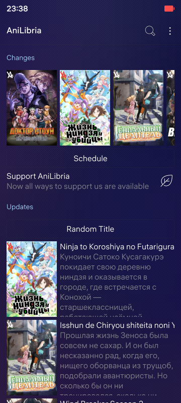
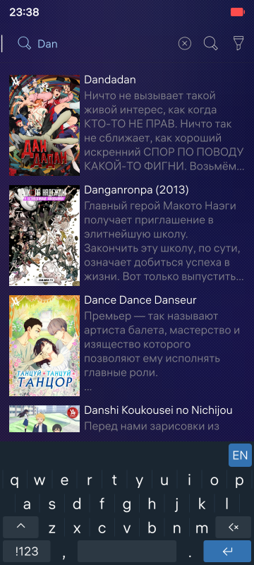
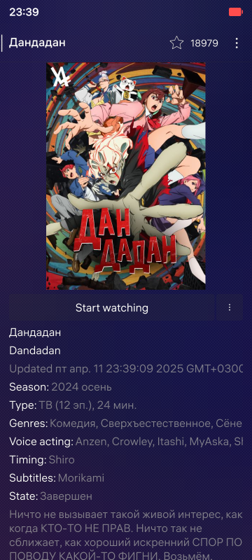
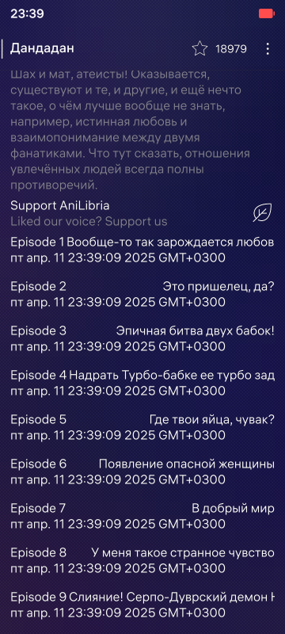
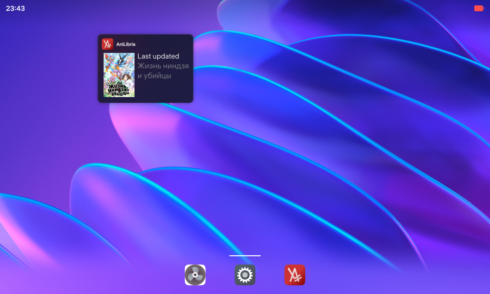

# AniLibria Aurora OS Client

## Introduction
Basic app built on Aurora OS components, which allows you to
- See latest changes on site
- See latest updates on site
- Search titles
- See full title information
- See title episodes list
- Play selected episode from the list:
a. Play/Pause
b. See current position
c. Use slider to change current position
d. Hide dock with a click on a video

## Roadmap
- Add Russian language translation
- Implement search filters
- Implement video download
- Implement video quality selection
- Add support for v1 AniLibria api (in case of v3 shutdown)

## Release
v0.1 is available on Releases page

## Screenshots

